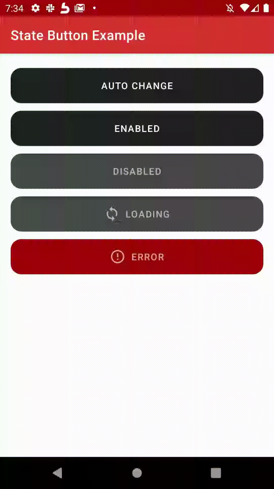

# State Button Android
[](https://jitpack.io/#armancodv/state-button-android)

state-button-android.svg
The state button is an android ui library based on material ui.


## Installation
Add it in your root `build.gradle` at the end of repositories:
```gradle
	allprojects {
		repositories {
			...
			maven { url 'https://jitpack.io' }
		}
	}
```
Add the dependency in app `build.gradle`
```gradle
	dependencies {
	        implementation 'com.github.armancodv:state-button-android:Tag'
	}
```
## How to use
It is the example use of the library.
```xml
    <com.armanco.state_button.StateButton
        android:id="@+id/button"
        android:layout_width="match_parent"
        android:layout_height="64dp"
        android:text="Click to be disabled"
        app:iconGravity="textStart"
        app:cornerRadius="16dp"
        app:state="enabled"
        app:enabledTextColor="#ffffff"
        app:enabledBackgroundColor="#212121"
        app:disabledTextColor="#bbbbbb"
        app:disabledBackgroundColor="#484848"
        app:loadingTextColor="#bbbbbb"
        app:loadingBackgroundColor="#484848"
        app:errorTextColor="#aaffffff"
        app:errorBackgroundColor="#9a0007"
         />
```
```kotlin
button?.state = State.DISABLED
```